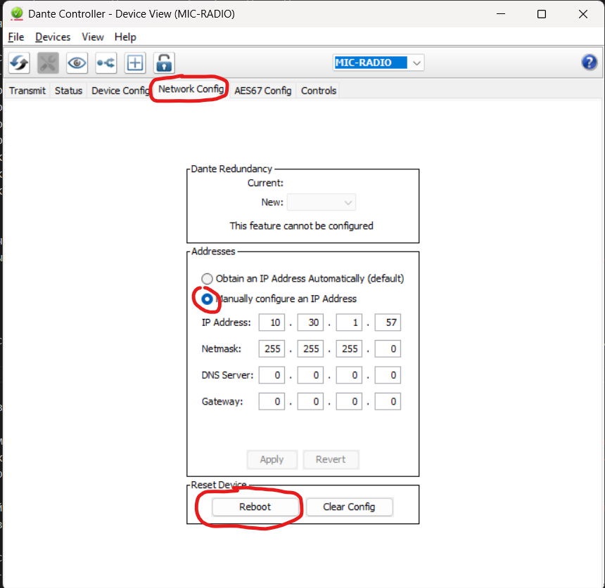

# Настройка коммутаторов

Необходимо на коммутаторе создать отдельный VLAN "AUDIO" для multicast траффика звуковых источников, а так же настроить qos на портах входящих в вышеуказанный VLAN.

Интерфейсы, в которые будет подключено звуковое оборудование (матрицы динамики, микрофоны и тд) заводятся в VLAN "AUDIO" в ACCESS состоянии.
Интерфейсы, в которые будут подключены мини-ПК и ГЕРСЫ с установленными демонами AES, находятся либо в состоянии TRUNK, либо в состоянии GENERAL с тэгированием трафика VLAN "AUDIO".

Пример настройки вланов на коммутаторе ELTEX:

```
vlan 30
  vlan active
!
mac access-list extended 1030
  permit any any vlan 30
!
class-map 30 
  match access-group mac-access-list 1030
  set class 30
!
policy-map 30
  set policy class 30 default-priority-type ipDscp 46
!
interface gigabitethernet 0/i
  switchport mode general
  switchport general allowed vlan add 30
  switchport general allowed vlan add 3 untagged
  switchport forbidden default-vlan
  switchport general pvid 3
  qos trust cos-dscp
  flowcontrol on
!
interface gigabitethernet 0/j
  switchport mode access
  switchport forbidden default-vlan
  switchport access vlan 30
  qos trust cos-dscp
  flowcontrol on
!
interface gigabitethernet 0/trunk
  switchport general allowed vlan add 3-4,30
  switchport forbidden default-vlan
  qos trust cos-dscp
!
```

# Настройка МиниПК и GERS

Настройка производится путем раскатки роли ansible из репозитория.

### Что делает роль

- Удаляет PulseAudio с конфигами юзера (кроме конференции)
- Устанавливает и конфигурирует aes67-daemon
- Создаёт Source для хостов, которые отдают звук
- Добавляет VLAN30 ко всем хостам
- Привязывает службу Lyra к службе aes67
- Настраивает sysctl для каждого хоста

# Настройка устройств Dante

## Подключение к сети
Для настройки устройств Dante необходимо находиться в той же сети, в которой они будут работать. В текущей конфигурации:
- Основная сеть: **10.30.1.0/24**
- Если будет несколько операционных: **10.30.2.0/24** и так далее.

## Настройка аудиокоммутатора Dante
Аудиокоммутатор имеет два интерфейса:
1. **Матрица (управление)** — используется для администрирования.
2. **Dante** — передача звука.

### Начальная настройка
1. Подключаемся к аудиокоммутатору через интерфейс матрицы, у которого по умолчанию IP **192.168.1.200/24**.
2. Открываем веб-интерфейс устройства.
3. Загружаем с веб-интерфейса и устанавливаем необходимый софт.
4. Подключаемся через этот софт к устройству:
   - **Логин**: `admin`
   - **Пароль**: `123456`
5. Изменяем сетевые настройки:
   - **Интерфейс матрицы**: `10.30.1.54/24`
   - **Интерфейс Dante**: `настраивается ниже по инструкции`

## Установка Dante Controller
Dante Controller необходим для настройки и связки Dante-устройств (микрофонов, динамиков, мини-ПК и т. д.).
1. Скачиваем и устанавливаем Dante Controller с [monisms.com](https://www.monisms.com/en-us/download).
2. Запускаем программу и, при необходимости, обновляем.

## Адресация устройств Dante (пример для первой операционной)

| Устройство                        | IP-адрес       |
|-----------------------------------|---------------|
| Аудиокоммутатор (управление)      | 10.30.1.54/24 |
| Аудиокоммутатор (Dante)           | 10.30.1.55/24 |
| Микрофон 1                        | 10.30.1.56/24 |
| Микрофон 2                        | 10.30.1.57/24 |
| Карточка USB (медсестра)          | 10.30.1.58/24 |
| Динамик 1                         | 10.30.1.59/24 |
| Динамик 2                         | 10.30.1.60/24 |

### DHCP-настройки
Dante-устройства получают адресацию по DHCP. Важно настроить DHCP-сервер в той же сети, **без раздачи шлюза и DNS**. Для этого можно использовать утилиту [Tftpd64](https://pjo2.github.io/tftpd64/)

## Поиск и настройка устройств в Dante Controller
1. Открываем интерфейс Dante Controller, нажимаем **Ctrl+D** и получаем список найденых устройств в выпадающем окне.


2. В появившемся списке даем устройствам удобные имена.


3. Назначаем статические IP-адреса.



4. Если появляются проблемы с отображением устройств, перезапускаем Dante Controller.

## Создание мульткаст-групп
Для корректной работы необходимо создать три мульткаста:
- **Конференция**
- **Инфотабло**
- **ГЕРС** (один мульткаст для всех устройств ГЕРС)

### Настройка мультикастов в Dante Controller
1. Открываем интерфейс Dante Controller, нажимаем **Ctrl+D**
2. Выбираем нашу аудиоматрицу и на вкладке Transmit создаем новый мультикаст.


3. Получаем:
   - **IP-адрес** (генерируется автоматически или настраивается вручную, порт `5004`)
   - **Номер мультикаста** (задается автоматически)
   - **Два канала TX** (можно переименовать для удобства)
4. Подтверждаем изменения.
5. Мы создали мультикаст для одного устройства. Надо повторить для остальных.


## Настройка Sink на устройствах с поддержкой AES67

Для приёма звука через Dante на мини-ПК и ГЕРС требуется создать Sink

### Адреса веб-интерфейсов и виды сущностей, которые должны быть созданы на каждом устройстве

| Устройство   | Функция       | Web-интерфейс |
|-------------|--------------|--------------|
| ГМУ         | Source       | http://10.30.1.30:8080 |
| Инфотабло   | Source/Sink  | http://10.30.1.37:8080 |
| Конференция | Source/Sink  | http://10.30.1.35:8080 |
| ГЕРС        | Sink         | http://10.30.1.5:8080  |

### Добавление Sink на примере конференции
1. Заходим в веб-интерфейс конференции `http://10.30.1.35:8080`.
2. Добавляем **Sink**.


3. В **Remote Source SDP** выбираем аудиокоммутатор с нужным мультикаст-номером.
4. Проверяем TX-каналы и IP-адрес в окне SDP.


5. Сохраняем изменения.

## Настройка коммутации устройств на Dante Controller

## Настройка матрицы на аудиокоммутаторе
