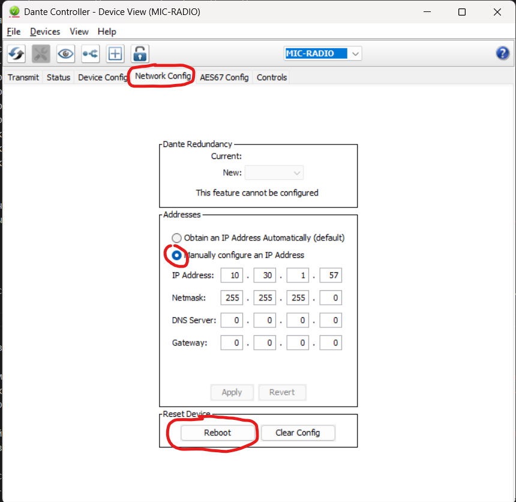
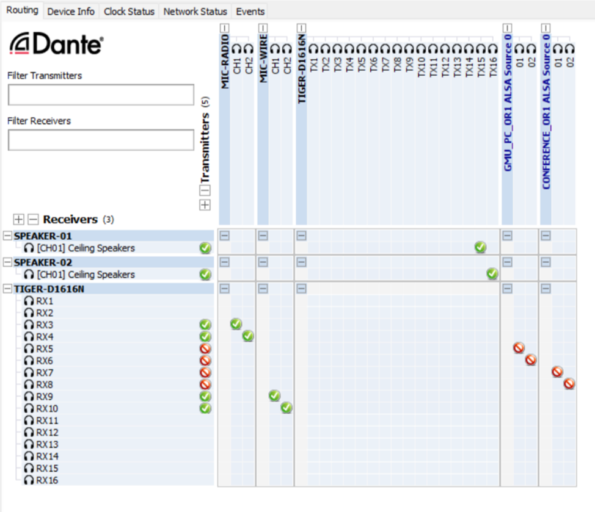

# Термины и определения

**`Sink` (Приёмник)** – программный компонент в Linux, принимающий аудиопоток по протоколу AES67 и воспроизводящий его через аудиосистему.

**`Source` (Источник)** – программный компонент в Linux, передающий аудиопоток по протоколу AES67 в сеть для дальнейшего воспроизведения на приёмниках.

**`Dante Controller`** – программное приложение для Windows и macOS, разработанное Audinate, предназначенное для управления аудиосетями, основанными на протоколе Dante. Позволяет настраивать маршрутизацию аудиопотоков, управлять устройствами, мониторить состояние сети и диагностировать проблемы в реальном времени.

**`QoS` (Quality of Service) на коммутаторах** – механизм управления сетевым трафиком, позволяющий приоритизировать определённые типы данных, такие как аудио и видео, для обеспечения стабильной задержки, минимизации потерь пакетов и предотвращения джиттера. В контексте аудиосетей (например, AES67 или Dante) QoS гарантирует, что критически важные аудиопотоки передаются с наивысшим приоритетом, избегая задержек из-за фонового трафика.

**`TX` (Transmit, передача)** – процесс отправки данных или аудиопотока от источника (`source`) в сеть.  

**`RX` (Receive, приём)** – процесс получения данных или аудиопотока приёмником (`sink`) из сети.

**`Multicast` (многоадресная передача)** – метод передачи аудиопотока по сети, при котором один источник (`source`) отправляет данные сразу нескольким получателям (`sink`) без дублирования трафика. В контексте аудио по сети, например AES67, multicast снижает нагрузку на источник и оптимизирует использование пропускной способности, позволяя нескольким устройствам одновременно получать один и тот же поток.

**`Multicast address` (Мультикастовый IP-адрес)** – это специальный диапазон IP-адресов (224.0.0.0 – 239.255.255.255), предназначенный для многоадресной передачи данных в сети. В контексте аудиопротоколов, таких как AES67 или Dante, мультикастовые IP-адреса используются для эффективного распространения аудиопотоков от одного источника сразу нескольким приёмникам без избыточного дублирования трафика.

# Настройка сетевых коммутаторов

Необходимо на коммутаторе создать отдельный `VLAN` "AUDIO" для `multicast` траффика звуковых источников, а так же настроить `QoS` на портах входящих в вышеуказанный `VLAN`.

Интерфейсы, в которые будет подключено звуковое оборудование (матрицы динамики, микрофоны и тд) заводятся в `VLAN` "AUDIO" в `ACCESS` состоянии.

Интерфейсы, в которые будут подключены мини-ПК и ГЕРСЫ с установленными демонами `aes67`, находятся либо в состоянии `TRUNK`, либо в состоянии `GENERAL` с тэгированием трафика `VLAN` "AUDIO".

Пример настройки `VLAN` на коммутаторе `ELTEX`:

```
vlan 30
  vlan active
!
mac access-list extended 1030
  permit any any vlan 30
!
class-map 30 
  match access-group mac-access-list 1030
  set class 30
!
policy-map 30
  set policy class 30 default-priority-type ipDscp 46
!
interface gigabitethernet 0/i
  switchport mode general
  switchport general allowed vlan add 30
  switchport general allowed vlan add 3 untagged
  switchport forbidden default-vlan
  switchport general pvid 3
  qos trust cos-dscp
  flowcontrol on
!
interface gigabitethernet 0/j
  switchport mode access
  switchport forbidden default-vlan
  switchport access vlan 30
  qos trust cos-dscp
  flowcontrol on
!
interface gigabitethernet 0/trunk
  switchport general allowed vlan add 3-4,30
  switchport forbidden default-vlan
  qos trust cos-dscp
!
```

# Настройка МиниПК и GERS

Настройка производится путем раскатки роли `ansible` из репозитория.

### Что делает роль

- Удаляет `PulseAudio` с конфигами юзера (кроме конференции)
- Устанавливает и конфигурирует `aes67-daemon`
- Создаёт `Source` для хостов, которые отдают звук
- Добавляет `VLAN30` ко всем хостам
- Привязывает службу `Lyra` к службе `aes67`
- Настраивает `sysctl` для каждого хоста

# Настройка устройств Dante

## Подключение к сети
Для настройки устройств Dante необходимо находиться в той же сети, в которой они будут работать. В текущей конфигурации:
- Основная сеть: **`10.30.1.0/24`**
- Если будет несколько операционных: **`10.30.2.0/24`** и так далее.

## Настройка аудиокоммутатора Dante на примере TIGER D1616N
Аудиокоммутатор имеет два интерфейса:

**Матрица (управление)** — используется для администрирования.

**Dante** — передача звука.

1. Подключаемся к аудиокоммутатору через интерфейс матрицы, у которого по умолчанию IP **192.168.1.200/24**.
2. Открываем веб-интерфейс устройства.
3. Загружаем с веб-интерфейса и устанавливаем софт `TIGER D1616N`.
4. Подключаемся через этот софт к устройству:
   - **Логин**: `admin`
   - **Пароль**: `123456`
5. Изменяем сетевые настройки:
   - **Интерфейс матрицы**: в соответствии с таблицей 1
   - **Интерфейс Dante**: настраивается ниже по инструкции в соответствии с таблицей 1

## Установка Dante Controller
1. Скачиваем и устанавливаем `Dante Controller`, например, с [monisms.com](https://www.monisms.com/en-us/download).
2. Запускаем программу и, при необходимости, обновляем.

### DHCP-настройки
Dante-устройства получают адресацию по DHCP. Важно настроить DHCP-сервер в той же сети, **без раздачи шлюза и DNS**. Для этого можно использовать утилиту [Tftpd64](https://pjo2.github.io/tftpd64/)

*Таблица 1. Адресация устройств Dante (пример для первой операционной)*

| Устройство                        | IP-адрес       |
|-----------------------------------|---------------|
| Аудиокоммутатор (управление)      | 10.30.1.54/24 |
| Аудиокоммутатор (Dante)           | 10.30.1.55/24 |
| Микрофон 1                        | 10.30.1.56/24 |
| Микрофон 2                        | 10.30.1.57/24 |
| Карточка USB (медсестра)          | 10.30.1.58/24 |
| Динамик 1                         | 10.30.1.59/24 |
| Динамик 2                         | 10.30.1.60/24 |

## Поиск и настройка устройств в Dante Controller

1. После того, как устройства получат ардеса по DHCP, открываем интерфейс `Dante Controller`, нажимаем **Ctrl+D** и получаем список найденых устройств в выпадающем окне.


2. В появившемся списке даем устройствам удобные имена.


3. Назначаем статические IP-адреса в соответствии с таблицей 1.



4. Если появляются проблемы с отображением устройств, перезапускаем `Dante Controller`.

## Включение поддержки устройств с протоколом aes67 на аудиокоммутаторе

1. Открываем интерфейс `Dante Controller`, нажимаем **Ctrl+D** и выбираем аудиокоммутатор из списка

2. Выбираем вкладку AES67 Config и переводим aes67 в enable

3. После настройки aes67 необходимо перезагрузить матрицу (кнопкой reboot и после по питанию)


# Настройка мультикастов в Dante Controller

## Создание мульткаст-групп
Для корректной работы необходимо создать три мульткаста:
- **Конференция**
- **Инфотабло**
- **ГЕРС** (один мульткаст для всех устройств ГЕРС)

1. Открываем интерфейс `Dante Controller`, нажимаем **Ctrl+D**
2. Выбираем нашу аудиоматрицу и на вкладке Transmit создаем новый мультикаст.


3. Получаем:
   - **IP-адрес** (генерируется автоматически или настраивается вручную (только мультикастовый ip-адрес), порт `5004`)
   - **Номер мультикаста** (задается автоматически)
   - **Два канала TX** (можно переименовать для удобства)
4. Подтверждаем изменения.
5. Мы создали мультикаст для одного устройства. Надо повторить для остальных.


## Настройка Sink и Source на устройствах с поддержкой AES67

*Таблица 2. Адреса веб-интерфейсов и виды сущностей, для устройств с поддержкой aes67*

| Устройство   | Функция       | Web-интерфейс |
|-------------|--------------|--------------|
| ГМУ         | Source       | http://10.30.1.30:8080 |
| Инфотабло   | Source+Sink  | http://10.30.1.37:8080 |
| Конференция | Source+Sink  | http://10.30.1.35:8080 |
| ГЕРС        | Sink         | http://10.30.1.5:8080  |

1.  Заходим в веб-интерфейс, например, ПК конференции `http://10.30.1.35:8080`.
2.  Во вкладке `Sinks` создаём **Sink**.


3.  В **Remote Source SDP** выбираем аудиокоммутатор с нужным мультикаст-номером.
4.  Проверяем TX-каналы и IP-адрес в окне SDP.


5.  Сохраняем изменения кнопкой `Submit`.
6.	Во вкладке `Sources` создаём **Source**.
7.	Редактируем поля, отмеченные стрелками на картинке, остальные не трогаем.
8.	RTP-адрес берём из вкладки `General`.
9.  Сохраняем изменения кнопкой `Submit`.


*ВАЖНО! `Source` на устройствах с поддержкой `aes67` создается автоматически при раскатке роли `ansible`. Настройку `Source` делаем только в том случае, если `ansible` по какой-то причине не создал `Source` или вы решили удалить текущий `Source` и создать новый.*

# Настройка аудиоматрицы и коммутации устройств на Dante Controller

Коммутированы Dante-устройства в `Dante Controller` на примере проекта `Бурназяна`.

По вертикали — `Transmitters (OUT)`.

По горизонтали — `Receivers (IN)`.

После добавления `Source` на устройство с поддержкой `aes67` оно отобразится в `Dante Controller` (выделены синим цветом). 



## Настройка передачи звука для ПК конференции

Нужно отправить звук с мини-ПК конференции на динамик операционной и направить звук с микрофонов операционной на ПК конференции.

### Направляем звук из мини-ПК конференции на динамик операционной

Для этого в программе `Dante Controller` скоммутируем выход звука из мини-ПК конференции на матрицу, как показано на скриншоте.
Каналы `1` и `2` мини-ПК конференции направлены на матрицу `RX7`, `RX8`.


В программе `TIGER D1616N` переходим во вкладку `Matrix` и выбираем коммутацию `Dante → Dante`, как показано на рисунке.


Назначаем любой свободный выход для динамика и направляем на него вход конференции. Для удобства для динамиков рекомендуется использовать выходы `TX15`, `TX16`.


Открываем `Dante Controller` и коммутируем аудиоматрицу с динамиками, как показано на рисунке.

Выходы `TX15`, `TX16` матрицы направляем на динамики `SPEAKER-01`, `SPEAKER-02`.

Тем самым мы зафиксировали что выходы `TX15`, `TX16`, которые мы выбрали на матрице `TIGER D1616N`, будут пренадлежать динамикам.


### Направляем звук с микрофона операционной в мини-ПК конференции

В программе `TIGER D1616N` во вкладке `Matrix` необходимо перенаправить звук с микрофонов в мультикаст ПК конференции. Для удобства для микрофона рекомендуется использовать входы `RX3`, `RX4`. Направляем их на `TX1`, `TX2`, которые были выбраны при создании `мультикастов` для ПК конференции (см. Создание мульткаст-групп)


В `Dante Controller` коммутируем микрофоны с аудиоматрицей на входы `RX3`, `RX4`, как показано на рисунке.

Тем самым мы зафиксировали что входы `RX3`, `RX4`, которые мы выбрали на матрице `TIGER D1616N`, будут пренадлежать микрофону.


После коммутации тестируем звук на ПК конференции и повторяем настройки для других устройств на linux
